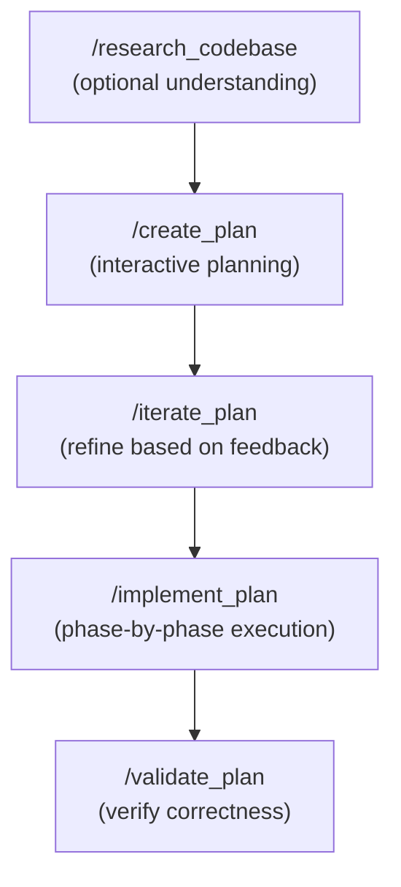

# Claude Code Planning Plugin

A plugin for [Claude Code](https://claude.ai/code) that provides structured planning and implementation workflows with minimal context overhead.

**Key benefit**: Parallel sub-agents research your codebase and return precise `file:line` references, keeping your main context lean while gathering comprehensive information.

## Installation

```bash
# Add marketplace
/plugin marketplace add nstrayer/claude-planning

# Install plugin
/plugin install bootandshoe@bootandshoe-claude-planning
```

## Workflow Overview

The plugin provides a phased workflow from research through implementation and validation:



## Commands Reference

| Command | Description | Workflow Position |
|---------|-------------|-------------------|
| `/create_plan` | Interactive planning with codebase research. Generates phased implementation plans with success criteria. | Start of workflow |
| `/create_plan_nt` | Same as `/create_plan` but works without a `thoughts/` directory | Start (no thoughts) |
| `/create_plan_generic` | Simplified plan creation with minimal project assumptions | Start (generic) |
| `/iterate_plan` | Update existing plans based on feedback or new requirements | After `/create_plan` |
| `/iterate_plan_nt` | Same as `/iterate_plan` but works without a `thoughts/` directory | After `/create_plan` |
| `/implement_plan` | Execute plans phase-by-phase with automated and manual verification | After plan approval |
| `/validate_plan` | Verify implementation against plan's success criteria | After implementation |
| `/research_codebase` | Spawn parallel agents to research and document codebase comprehensively | Any time |
| `/research_codebase_nt` | Same as `/research_codebase` but works without a `thoughts/` directory | Any time |
| `/research_codebase_generic` | Minimal assumptions research for unfamiliar codebases | Any time |

## Command Variants

Commands have variants indicated by suffixes:

| Suffix | Meaning | Use When |
|--------|---------|----------|
| *(none)* | Full-featured with `thoughts/` directory support | You have a `thoughts/` directory for storing plans and research |
| `_nt` | "No Thoughts" - works without `thoughts/` directory | Project doesn't use a thoughts directory |
| `_generic` | Minimal project-specific assumptions | Working with unfamiliar codebases or want no assumptions |

## Agents

The plugin includes specialized agents that research your codebase in parallel:

| Agent | Purpose |
|-------|---------|
| `codebase-locator` | Finds WHERE files and components live by topic or feature |
| `codebase-analyzer` | Understands HOW code works, explains implementations |
| `codebase-pattern-finder` | Finds similar implementations and patterns to model after |
| `thoughts-locator` | Discovers relevant documents in the `thoughts/` directory |
| `thoughts-analyzer` | Extracts insights and decisions from `thoughts/` documents |
| `web-search-researcher` | Researches external documentation and APIs |

Agents are **documentarians** - they describe what exists without suggesting improvements. They return precise `file:line` references rather than full file contents, keeping your context efficient.

## Usage Examples

### Planning Workflow

```bash
# Start with research to understand the codebase (optional)
/research_codebase
# Then describe what you want to understand

# Create a plan interactively
/create_plan
# Claude will ask clarifying questions and research the codebase

# Create plan from a requirements file
/create_plan path/to/requirements.md

# Iterate on an existing plan after feedback
/iterate_plan thoughts/shared/plans/2025-01-08-feature.md

# Implement the plan
/implement_plan thoughts/shared/plans/2025-01-08-feature.md

# Validate the implementation
/validate_plan thoughts/shared/plans/2025-01-08-feature.md
```

### Research Only

```bash
# Research without planning
/research_codebase
# Then: "How does authentication work in this codebase?"

# Without thoughts directory
/research_codebase_nt
```

## Output Structure

Plans and research are stored in the `thoughts/` directory:

```
thoughts/
└── shared/
    ├── plans/      # YYYY-MM-DD-description.md (from /create_plan)
    └── research/   # YYYY-MM-DD-description.md (from /research_codebase)
```

Use `_nt` variants if your project doesn't have a `thoughts/` directory, or specify custom output paths.

## Key Principles

1. **Parallel research**: Multiple agents research concurrently for efficiency
2. **Precise references**: Agents return `file:line` references, not full file contents
3. **Document, don't critique**: Agents describe what exists without suggesting changes
4. **Separated verification**: Plans distinguish automated checks (tests, linting) from manual testing
5. **Phased implementation**: Execute plans step-by-step with verification at each phase
