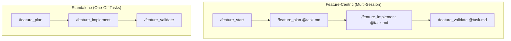

# Claude Code Planning Plugin

A plugin for [Claude Code](https://claude.ai/code) that provides structured planning and implementation workflows with minimal context overhead.

**Key benefit**: Feature-centric workflow with a task document that maintains context across sessions. Parallel sub-agents research your codebase and return precise `file:line` references.

## Installation

```bash
# Add marketplace
/plugin marketplace add nstrayer/claude-planning

# Install plugin
/plugin install bootandshoe@bootandshoe-claude-planning
```

## Workflow Overview



## Commands Reference

| Command | Description |
|---------|-------------|
| `/feature_start` | Start new feature with task document and PRD |
| `/feature_plan` | Interactive planning with codebase research |
| `/feature_implement` | Execute plans phase-by-phase with verification |
| `/feature_validate` | Validate implementation against PRD + plan |
| `/feature_iterate` | Update existing plans based on feedback |
| `/research` | Spawn parallel agents for codebase research |
| `/oneshot` | Quick plan-and-execute for simple tasks |

## Agents

Specialized agents research your codebase in parallel:

| Agent | Purpose |
|-------|---------|
| `codebase-locator` | Finds WHERE files and components live |
| `codebase-analyzer` | Understands HOW code works |
| `codebase-pattern-finder` | Finds similar implementations to model after |
| `thoughts-locator` | Discovers relevant documents in `thoughts/` |
| `thoughts-analyzer` | Extracts insights from `thoughts/` documents |
| `web-search-researcher` | Researches external documentation and APIs |

Agents are **documentarians** - they describe what exists without suggesting improvements. They return precise `file:line` references rather than full file contents.

## Usage Examples

### Feature Workflow (Multi-Session)

```bash
# Start feature from GitHub issue
/feature_start https://github.com/org/repo/issues/123

# Or start without an issue (interactive PRD creation)
/feature_start

# Create plan (outputs to feature directory)
/feature_plan @thoughts/features/issue-123-feature/task.md

# Implement the plan
/feature_implement @thoughts/features/issue-123-feature/task.md

# Validate against both PRD and plan
/feature_validate @thoughts/features/issue-123-feature/task.md
```

### Standalone Workflow (One-Off Tasks)

```bash
# Create a plan interactively
/feature_plan

# Or from a requirements file
/feature_plan path/to/requirements.md

# Implement the plan
/feature_implement thoughts/shared/plans/2025-01-08-feature.md

# Validate implementation
/feature_validate thoughts/shared/plans/2025-01-08-feature.md
```

### Research Only

```bash
# Research codebase without planning
/research
# Then: "How does authentication work in this codebase?"
```

## Output Structure

```
thoughts/
├── features/           # Feature-centric workflows
│   └── {slug}/
│       ├── task.md     # Context anchor (status, decisions, activity)
│       ├── prd.md      # Product requirements
│       └── plan.md     # Implementation plan
└── shared/
    ├── plans/          # Standalone plans
    ├── prds/           # Standalone PRDs
    └── research/       # Research documents
```

Feature directories are created by `/feature_start`. The task document maintains context across sessions and tracks status through: `planning` -> `planned` -> `implementing` -> `validating` -> `complete`

## Key Principles

1. **Feature-centric**: Task documents anchor context across sessions
2. **Parallel research**: Multiple agents research concurrently for efficiency
3. **Precise references**: Agents return `file:line` references, not full file contents
4. **Document, don't critique**: Agents describe what exists without suggesting changes
5. **Separated verification**: Plans distinguish automated checks from manual testing
